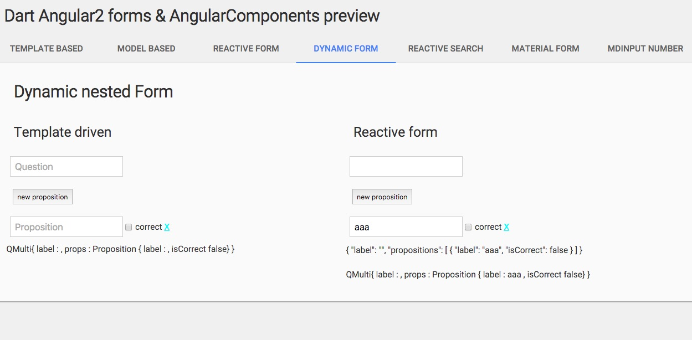

# AngularDart 4.0.0 / angular_forms 1.0.0 

[Demo](https://rxlabz.github.io/angular-dart-forms-examples/)

- [reactive search](https://github.com/rxlabz/angular-dart-forms-examples/tree/master/lib/components/reactive-search) : map input value changes to JSON decoded GET request results
- [dynamic nested form (controlArray) - template driven & reactive](https://github.com/rxlabz/angular-dart-forms-examples/tree/master/lib/components/dynamic-form) : FormModel
- template based form
- model based form
- reactive form
- material model form : AngularComponents 

